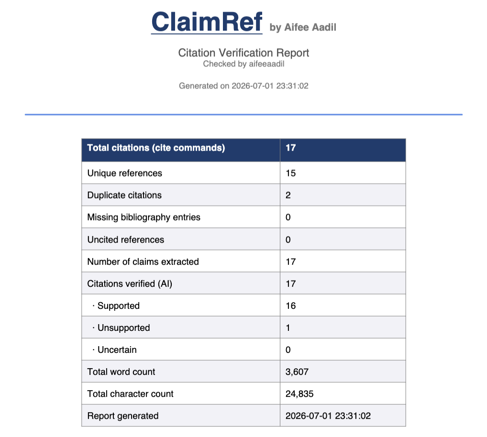
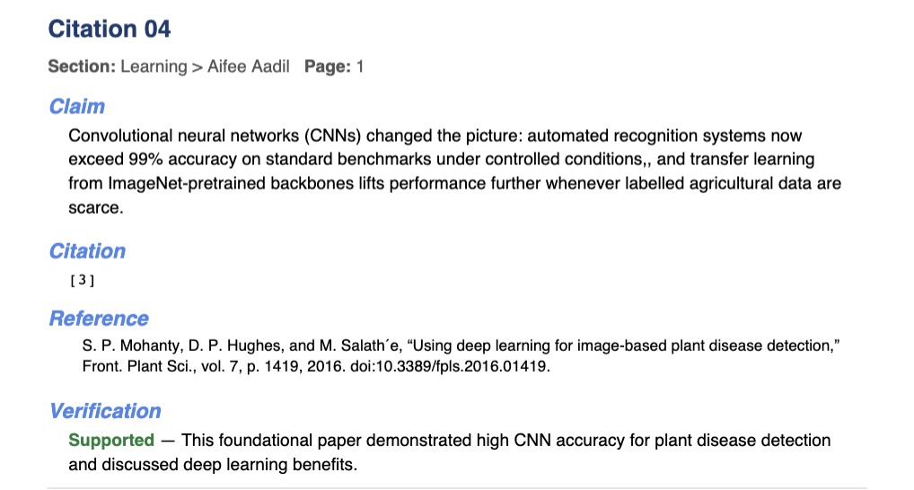
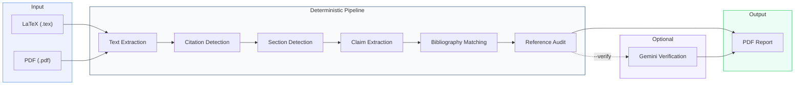
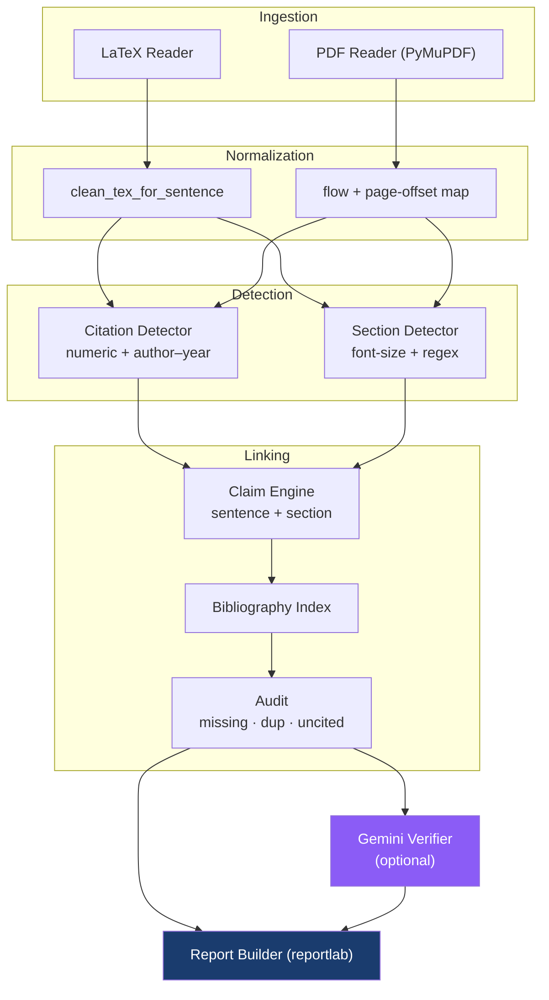

<div align="center">

# ClaimRef

### From a paper's citations to the *reasoning* behind them.

*A citation-verification toolkit that reconstructs **which claim each reference supports** — and, optionally, **whether it actually does.***

<br/>

[](https://www.python.org/)
[](#-license)
[](#-use-cases)
[](#-ai-citation-verification)

[](https://www.reportlab.com/)
[](https://pymupdf.readthedocs.io/)
[](https://bibtexparser.readthedocs.io/)
[](https://ai.google.dev/)

<br/>

**LaTeX & PDF** · **IEEE / ACM / Springer / Nature / Elsevier / APA** · **Numeric & Author–Year** · **AI-assisted verification** · **Publication-ready reports**

</div>

---

<div align="center">

> ### A bibliography tells you **what** was cited.
> ### ClaimRef tells you **why** — and helps you check **whether it holds.**

</div>

---

## Abstract

Every research paper rests on a scaffold of citations, yet that scaffold is presented to the reader as an *alphabetised list stripped of context*. To judge whether a claim is well-supported, a reader must repeatedly cross-reference in-text markers against the bibliography — a slow, error-prone loop that scales poorly with paper count.

**ClaimRef** is a lightweight, deterministic toolkit that ingests a finished manuscript (**LaTeX** or **PDF**), reconstructs the **claim ↔ section ↔ reference** relationship for *every* in-text citation, audits the reference list for structural defects (missing, duplicate, and uncited entries), and renders a single, archival **Citation Verification Report**. An optional AI stage uses a large language model to assess whether each cited reference *plausibly supports* the claim it is attached to, turning a manual reviewing chore into a one-command pass.

The tool was built while quantifying the laboratory-to-field generalisation gap in a deep-learning study — a project where **citation integrity and external validation were themselves the research question.** ClaimRef operationalises that same discipline for the literature that surrounds any paper.

---

## Table of Contents

- [Research Contributions](#research-contributions)
- [What ClaimRef Does](#what-claimref-does)
- [Why It Exists](#why-it-exists)
- [Features](#features)
- [AI Citation Verification](#ai-citation-verification)
- [The Report](#the-report)
- [Report Preview](#report-preview)
- [Installation](#installation)
- [Configuration](#configuration)
- [Usage](#usage)
- [How It Works](#how-it-works)
- [Architecture](#architecture)
- [Supported Formats](#supported-formats)
- [Use Cases](#use-cases)
- [Comparison](#how-it-compares)
- [Design Principles](#design-principles)
- [Limitations & Scope](#limitations--scope)
- [Roadmap](#roadmap)
- [Contributing](#contributing)
- [License](#license)
- [Author](#author)

---

## Research Contributions

ClaimRef is small, but it makes a few deliberate, defensible design contributions:

1. **A shared claim-extraction engine** that treats LaTeX and PDF as two front-ends to *one* deterministic pipeline — the same sentence-tokeniser, section-tracker, and report renderer serve both.
2. **Abbreviation-safe sentence segmentation** tuned for scientific prose (`et al.`, `e.g.`, `Fig.`, decimals, initials) so claims aren't fragmented mid-thought.
3. **Style-agnostic citation resolution** — numeric `[n]`/ranges and author–year `(Author, YEAR)` are auto-detected and reconciled against the reference list, with math intervals such as `[0,1]` correctly rejected as *non-citations*.
4. **A structural citation audit** — missing, duplicate, and uncited references are surfaced explicitly, the way a careful reviewer would flag them.
5. **Optional LLM-in-the-loop verification** that is *bolted on, not baked in* — the deterministic core is fully usable without any network or API key.

---

## What ClaimRef Does

Given a research paper — **LaTeX** or **PDF** — ClaimRef automatically:

- detects **every in-text citation** (numeric, ranges, author–year, multi-key)
- extracts the **complete claim** surrounding each citation
- resolves the **section hierarchy** it lives in (`Methods > Dataset > Preprocessing`)
- matches each citation to its **bibliography entry** (`thebibliography`, `.bib`, or parsed PDF refs)
- stamps the **page number** (PDF input)
- audits for **missing, duplicate, and uncited** references
- *(optional)* asks **Gemini** whether each reference **supports its claim**
- renders one clean, branded **Citation Verification Report** PDF

<div align="center">

```
Paper  ─►  claim ↔ section ↔ reference  ─►  audit + AI verdict  ─►  one report PDF
```

</div>

---

## Why It Exists

Reading a paper's references is one of the most **inefficient** parts of research. To understand *why* `[12]` was cited you must scroll to it, read the surrounding sentence, flip to the bibliography, find entry 12, mentally bind claim ↔ reference — then repeat 40+ times, losing the thread every pass.

<table>
<tr>
<td width="50%" valign="top">

### The manual loop

- Jump to each `[n]` in the body
- Re-read the sentence around it
- Flip to the bibliography, find the entry
- Hold "claim ↔ reference" in your head
- Repeat for *every* citation
- Never see the whole picture at once

</td>
<td width="50%" valign="top">

### With ClaimRef

- Run **one command**
- Get a report where **every** citation shows its **claim + section + reference** together
- Skim linearly, top to bottom
- Catch missing / uncited / over-used references instantly
- *(optional)* read an **AI verdict** per citation

</td>
</tr>
</table>

> [!NOTE]
> ClaimRef began from a simple frustration: *"I know the paper cites 19 references — but which claim does each one actually back up, and does it hold?"* A bibliography can't answer that. ClaimRef does.

---

## Features

### Citation Intelligence
| | |
|---|---|
| **Numeric styles** | `[12]`, `[3, 4]`, `[5–7]` (IEEE / ACM) |
| **Author–year styles** | `(Mohanty et al., 2016)`, `Mohanty et al. (2016)` (Springer / Nature / Elsevier / APA) |
| **Multi-key citations** | `\cite{a, b, c}` and `(Smith, 2019; Doe, 2020)` split correctly |
| **Auto style detection** | Numeric vs author–year chosen automatically |
| **Notation guard** | Math intervals like `[0,1]` are rejected, not miscounted as `[0]` and `[1]` |

### Claim Extraction
| | |
|---|---|
| **Sentence-level claims** | The full sentence carrying each citation |
| **Smart context growth** | Short claims are extended with neighbouring sentences |
| **Abbreviation-aware** | Won't split on `et al.`, `e.g.`, `Fig.`, decimals, or initials |
| **Robust LaTeX cleaning** | Strips preamble, math, figures, tables; survives escaped `\$`, `\%`, `\&` |

### Structure & Audit
| | |
|---|---|
| **Section hierarchy** | `Methodology > Dataset > Preprocessing` |
| **Font-based headings (PDF)** | Detects headings by font size / weight, with a regex fallback |
| **Page numbers (PDF)** | Every citation stamped with its page |
| **Missing entries** | Citations with no matching reference — flagged in red |
| **Repeated citations** | References cited more than once, ranked by frequency |
| **Uncited references** | Bibliography entries never cited — the classic reviewer red flag |

### AI Verification *(opt-in)*
| | |
|---|---|
| **Per-citation verdict** | `Supported` / `Unsupported` / `Uncertain` + a one-line reason |
| **Summary counts** | Rolled up onto the report's first-page statistics table |
| **Fully optional** | No API key, no `requests`? The deterministic report still builds |

---

## AI Citation Verification

Pass `--verify` and ClaimRef sends each **(claim, reference)** pair to Google **Gemini** and asks a single, focused question: *does this reference plausibly support this claim?* Each verdict is folded back into the report next to its citation.

```bash
python3 citer.py paper.tex -o report.pdf --verify
```

```text
INFO: Verifying 16 citation(s) with gemini-2.5-flash…
INFO: Received verdicts for 16/16 citation(s).
```

In the report, each citation gains a **Verification** line:

> **Supported** — FAO yearbooks are authoritative sources for global crop-production statistics.
> **Unsupported** — reference is a PCA textbook; claim concerns field-imagery domain shift.
> **Uncertain** — reference topic is adjacent but the specific figure can't be confirmed.

…and the first-page table gains a rollup:

```
Citations verified (AI)   16
  · Supported             12
  · Unsupported            4
  · Uncertain              0
```

> [!IMPORTANT]
> **Scope of the AI verdict.** ClaimRef sends the *claim* and the *bibliographic reference* (title, venue, authors), not the full text of the cited paper. The model therefore judges **plausibility** from reference metadata plus its own prior knowledge — treat verdicts as a **triage signal that flags citations worth checking by hand**, not as ground truth. This honest boundary is by design: the tool surfaces suspicion, the human confirms it.

---

## The Report

Each generated **Citation Verification Report** is a self-contained PDF:

| Section | Contents |
|---|---|
| **Cover** | Tool identity, tagline, checker name, timestamp |
| **Statistics** | Totals · unique refs · duplicates · missing · **uncited** · claims · (AI verdicts) · word/char counts |
| **Citation NN** | One block per citation, in document order |
| ┣ **Section / Page** | Where the citation appears |
| ┣ **Claim** | The exact sentence(s) making the claim |
| ┣ **Citation** | The raw citation command / marker |
| ┣ **Reference** | The full matched bibliography entry |
| ┗ **Verification** | *(with `--verify`)* the AI verdict + reason |
| **Missing Bibliography Entries** | Cited keys with no reference — broken citations |
| **Repeated Citations** | Over-used references, with counts |
| **Uncited References** | Listed but never cited |
| **Header / Footer** | Branding + page numbers on every page |

> Diagnostic sections only appear when they have content — a clean paper produces a clean report.

---

## Report Preview

<div align="center">

<table>
<tr>
<td width="50%"></td>
<td width="50%"></td>
</tr>
<tr>
<td align="center"><b>Cover + Statistics</b></td>
<td align="center"><b>Per-Citation Breakdown</b></td>
</tr>
</table>

</div>

---

## Installation

```bash
# 1. Clone
git clone https://github.com/LunarLumos/claimref.git
cd claimref

# 2. Core dependencies
pip install reportlab bibtexparser pymupdf

# 3. (optional) AI verification
pip install requests          # only needed for --verify
```

**Requirements**

| Package | Purpose | Required for |
|---|---|---|
| `reportlab` | PDF report generation | Always |
| `bibtexparser` | `.bib` file parsing | LaTeX with `.bib` |
| `pymupdf` | PDF text + font extraction | PDF input |
| `requests` | Gemini API calls | `--verify` only |
| `PyYAML` | `api.yml` parsing | Optional — a built-in fallback parser is used if absent |

> [!TIP]
> Only need LaTeX support? `reportlab` alone gets you started. `pymupdf`, `requests`, and `PyYAML` are each imported **lazily**, so you never pay for a feature you don't use.

---

## Configuration

AI verification reads its credentials from **`api.yml`** beside the script:

```yaml
# api.yml
gemini_api_key: "YOUR_GEMINI_API_KEY"
gemini_model: "gemini-2.5-flash"
```

Resolution order (highest priority first):

1. Environment variables — `GEMINI_API_KEY`, `GEMINI_MODEL`
2. `api.yml`
3. Built-in default model (`gemini-2.5-flash`)

> [!WARNING]
> `api.yml` holds a live secret and is listed in `.gitignore` — **never commit a real key.** Prefer the `GEMINI_API_KEY` environment variable in shared or CI environments, and rotate any key that has been exposed. Get a key from [Google AI Studio](https://ai.google.dev/).

---

## Usage

ClaimRef auto-detects the input type from the file extension.

```bash
# LaTeX paper → report
python3 citer.py paper.tex -o report.pdf

# PDF paper → report (numeric or author–year, auto-detected)
python3 citer.py paper.pdf -o report.pdf

# Add AI verification
python3 citer.py paper.tex -o report.pdf --verify

# Default output name (claims_report.pdf)
python3 citer.py paper.tex
```

<details>
<summary><b>CLI reference</b></summary>

<br/>

```
usage: citer.py [-h] [-o OUTPUT] [--verify] source

positional arguments:
  source                Path to the paper: .tex (LaTeX) or .pdf

options:
  -h, --help            show this help message and exit
  -o, --output OUTPUT   Output PDF filename (default: claims_report.pdf)
  --verify              Use Gemini to check whether each citation supports
                        its claim (needs 'requests' and a GEMINI_API_KEY)
```

</details>

---

## How It Works

ClaimRef runs a **deterministic, dependency-light** pipeline. No black boxes in the core path.



<details>
<summary><b>Step-by-step internals (click to expand)</b></summary>

<br/>

**LaTeX path**
1. **Resolve includes** — recursively inlines `\input{}` / `\include{}`.
2. **Clean markup** — extracts the `document` body, strips math/figures/tables/footnotes, keeps `\cite*` and `\section*`, and protects escaped `\$ \% \&` so a literal `\$` can't swallow the surrounding text.
3. **Parse bibliography** — reads `thebibliography` **and** any `.bib` referenced via `\bibliography{}` / `\addbibresource{}`.
4. **Detect citations & sections** — positional scan → placeholder substitution.
5. **Extract claims** — abbreviation-safe sentence tokenisation, section tracking, short-claim growth.

**PDF path**
1. **Extract text** — PyMuPDF, with hyphenation repair and a page-offset map.
2. **Split references** — locate the `References` block and parse entries.
3. **Detect citation style** — numeric `[n]` first (validated against the reference list), else author–year.
4. **Detect sections** — font-size / weight heading detection, regex fallback.
5. **Extract claims** — same engine as LaTeX, plus **page numbers**.

**Both paths** converge on one `records → audit → report` renderer, with the AI stage layered on top only when `--verify` is set.

</details>

---

## Architecture



<details>
<summary><b>Internal module map (inside <code>citer.py</code>)</b></summary>

<br/>

| Zone | Responsibility |
|---|---|
| `sent_tokenize` | Abbreviation-safe sentence splitting |
| `resolve_input_include` / `clean_tex_for_sentence` | LaTeX pre-processing |
| `parse_thebibliography` / `load_bibtex` | LaTeX bibliography sources |
| `extract_citations` / `extract_sections` | LaTeX detection |
| `extract_pdf*` / `build_authoryear_refs` | PDF ingestion & parsing |
| `extract_claims` | Shared claim + section engine |
| `verify_claims` | Optional Gemini verification |
| `build_pdf` | Branded report renderer + audit sections |

</details>

---

## Supported Formats

<div align="center">

| Publisher / Style | Citation Format | Input | Status |
|:---|:---:|:---:|:---:|
| **IEEE** | Numeric `[n]` | PDF · LaTeX | ✅ |
| **ACM** | Numeric `[n]` | PDF · LaTeX | ✅ |
| **Springer** | Author–Year | PDF · LaTeX | ✅ |
| **Nature** | Author–Year | PDF · LaTeX | ✅ |
| **Elsevier** | Author–Year | PDF · LaTeX | ✅ |
| **APA** | Author–Year | PDF · LaTeX | ✅ |
| **BibTeX** (`.bib`) | Key-based | LaTeX | ✅ |
| **thebibliography** | Key-based | LaTeX | ✅ |
| **Scanned PDF** | — | OCR | Planned |

</div>

---

## Use Cases

<table>
<tr>
<td width="33%" valign="top">

### Literature Review
See every claim and its support in one pass — build a review from structure, not scattered PDFs.

</td>
<td width="33%" valign="top">

### Peer Review
Instantly spot claims leaning on weak, missing, or mismatched references — with an AI second opinion.

</td>
<td width="33%" valign="top">

### Pre-Submission Audit
Check your own manuscript before submission — no uncited, duplicated, or broken references.

</td>
</tr>
<tr>
<td width="33%" valign="top">

### Research Discovery
Find which references carry the most claims — your next must-read papers.

</td>
<td width="33%" valign="top">

### Knowledge Mining
Convert a corpus of papers into claim ↔ reference datasets.

</td>
<td width="33%" valign="top">

### Integrity Checking
Catch citation padding, orphan references, and unsupported claims automatically.

</td>
</tr>
</table>

---

## How It Compares

Reference managers **store** citations. ClaimRef **understands and audits** them.

<div align="center">

| Capability | Zotero | Mendeley | EndNote | **ClaimRef** |
|:---|:---:|:---:|:---:|:---:|
| Organise a library | ✅ | ✅ | ✅ | — |
| Insert citations while writing | ✅ | ✅ | ✅ | — |
| Extract the **claim** behind a citation | ❌ | ❌ | ❌ | ✅ |
| Link claim ↔ section ↔ reference | ❌ | ❌ | ❌ | ✅ |
| Per-citation **page numbers** (PDF) | ❌ | ❌ | ❌ | ✅ |
| Flag **missing / duplicate / uncited** refs | ⚠️ | ⚠️ | ⚠️ | ✅ |
| **AI** claim–reference verification | ❌ | ❌ | ❌ | ✅ |
| Produce a **review-ready report** | ❌ | ❌ | ❌ | ✅ |
| Works on a **finished** paper you didn't write | ❌ | ❌ | ❌ | ✅ |

</div>

> [!IMPORTANT]
> ClaimRef is **complementary** to reference managers. They help you *write*; ClaimRef helps you *understand, audit, and verify.*

---

## Design Principles

- **Single file, few dependencies** — `citer.py` is easy to read, audit, and vendor.
- **Deterministic core** — no ML in the base path; same input → same report. AI is strictly opt-in.
- **One shared engine** — LaTeX and PDF converge on a single claim/audit/report renderer.
- **Graceful degradation** — a missing `.bib`, no sections, an unknown style, or an absent API key each fail *loudly and locally*, never silently corrupting the output.
- **Secrets stay out of git** — credentials live in `api.yml` / env vars, not in source.

---

## Limitations & Scope

Stated plainly, because honest boundaries matter:

- **AI verdicts are plausibility, not proof.** The model sees the claim and the *reference metadata*, not the cited paper's full text (see [AI Citation Verification](#ai-citation-verification)).
- **PDF parsing is heuristic.** Section and reference detection depend on layout; unusual templates may need a tweak. LaTeX input is the most reliable source.
- **Scanned / image-only PDFs are unsupported** until OCR lands (see roadmap).
- **Claim = sentence(s).** ClaimRef extracts the sentence(s) around a citation, not a discourse-level argument spanning paragraphs.

---

## Roadmap

- [x] AI claim–reference verification — *shipped (`--verify`)*
- [x] Uncited / duplicate / missing reference audit — *shipped*
- [ ] OCR support — scanned / image-only PDFs via Tesseract
- [ ] CrossRef & DOI enrichment — auto-complete references
- [ ] Confidence scores for AI citation support
- [ ] HTML + JSON export alongside PDF
- [ ] Citation graph visualisation
- [ ] Interactive dashboard
- [ ] arXiv API + citation recommendation

> Have an idea? [Open an issue](https://github.com/LunarLumos) — the roadmap is community-driven.

---

## Contributing

Contributions are welcome and appreciated.

```bash
# 1. Fork & clone
git clone https://github.com/<you>/claimref.git

# 2. Create a feature branch
git checkout -b feature/amazing-idea

# 3. Make changes, then verify on a sample paper
python3 citer.py v10.tex -o report.pdf

# 4. Commit & open a PR
git commit -m "feat: amazing idea"
```

**Good first contributions**
- Improve PDF heading detection for a specific publisher layout
- Add a new citation-style pattern
- Add sample papers + expected outputs
- Improve docs & examples

> [!NOTE]
> Please keep the **core** dependency-light and deterministic, and AI **opt-in** — that's ClaimRef's promise.

---

## License

Released under the **MIT License** — free to use, modify, and distribute.

```
MIT (c) Aifee Aadil (LunarLumos)
```

---

## Author

<div align="center">

**Built by Aifee Aadil**

[](https://github.com/LunarLumos)

</div>

---

<div align="center">

### Built for researchers who take citations seriously.

*ClaimRef turns a paper's citations into structured, auditable knowledge —*
*so you spend less time chasing references and more time judging whether they hold.*

<br/>

**If ClaimRef helps your research, consider starring the repository.**

<br/>

`Papers → Structured, Verifiable Research Knowledge`

</div>
