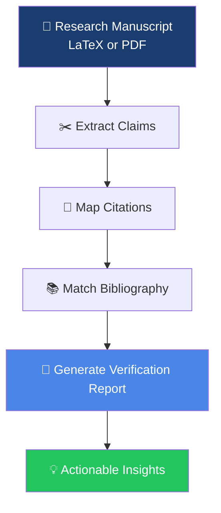
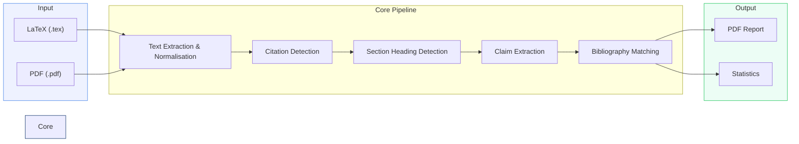
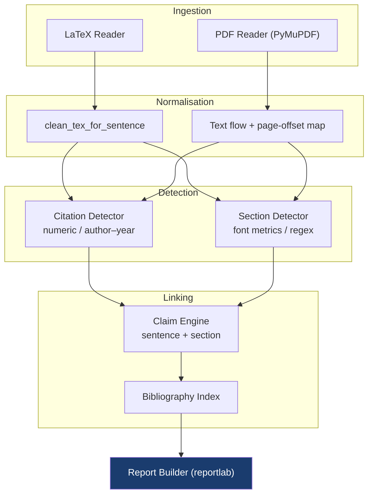

<div align="center">

# ClaimRef

### Transform Citation‑Dense Papers into Structured Research Knowledge

*An academic tool that reveals not only **what** was cited — but **why**.*

<br/>

[](https://www.python.org/)
[](#-license)
[](#-use-cases)
[](#)

[](https://www.reportlab.com/)
[](https://pymupdf.readthedocs.io/)
[](https://bibtexparser.readthedocs.io/)

<br/>

**LaTeX & PDF** ·  **IEEE / ACM / Springer / Nature / Elsevier** ·  **Numeric & Author–Year** ·  **Scholarly Reports**

</div>

---

<div align="center">

> ### A bibliography documents *what* sources were consulted.
> ### ClaimRef documents *why* each source was cited.

</div>

---

## Contents

- [Overview](#-overview)
- [Motivation](#-motivation)
- [Key Features](#-key-features)
- [Research Workflow](#-research-workflow)
- [Pipeline Details](#-pipeline-details)
- [Supported Formats](#-supported-formats)
- [Example](#-example)
- [Report Structure](#-report-structure)
- [Installation](#-installation)
- [Usage](#-usage)
- [Use Cases](#-use-cases)
- [Comparison with Reference Managers](#-comparison-with-reference-managers)
- [Statistics Explained](#-statistics-explained)
- [System Architecture](#-system-architecture)
- [Roadmap](#-roadmap)
- [License](#-license)
- [Author](#-author)

---

## Overview

**ClaimRef** is not a citation manager. Rather, it is a static analysis tool for academic manuscripts. It ingests a finished paper — in either LaTeX or PDF form — and produces a structured **Citation Verification Report**. This report pairs every in‑text citation with:

- the precise **claim** (sentence) it supports,
- the **section** (and page, for PDFs) in which it appears,
- the full **bibliographic entry**,
- and a summary of **citation statistics** (duplicates, missing references, etc.).

The output is a self‑contained, human‑readable PDF that can be audited directly or submitted to an AI assistant for further verification. The central tenet of ClaimRef is:

<div align="center">

```
Papers  ──►  Structured Research Knowledge
        (not merely a list of references)
```

</div>

---

## Motivation

Traditional bibliographies serve a single purpose: they list what was cited. They do not convey **where** or **why** a source was invoked. As a result, researchers, reviewers, and readers must repeatedly cross‑reference in‑text markers with a flat list — a fragmented and error‑prone process.

ClaimRef addresses this gap by automatically extracting the context of each citation. Instead of asking *“What does reference [12] say?”*, the user can immediately see *“The authors cite [12] to support the claim that …”*.

> [!NOTE]
> ClaimRef originated from a practical need: *“This paper cites 19 references — which statement does each one actually substantiate?”* The bibliography alone could not answer this. ClaimRef provides that answer in a single, linear report.

---

## Key Features

### Citation Detection
| | |
|---|---|
| **Numeric styles** | `[12]`, `[3,4]`, `[5–7]` (IEEE, ACM) |
| **Author–year styles** | `(Mohanty et al., 2016)`, `Mohanty et al. (2016)` (Springer, Nature, Elsevier, APA) |
| **Multi‑key commands** | `\cite{a,b,c}` and `(Smith, 2019; Doe, 2020)` are correctly split |
| **Style auto‑detection** | Numeric or author–year is selected without manual configuration |

### Claim Extraction
| | |
|---|---|
| **Sentence‑level claims** | The complete sentence containing the citation marker |
| **Context expansion** | Claims shorter than 10 words are extended with adjacent sentences |
| **Abbreviation‑aware tokenisation** | Protects `e.g.`, `et al.`, `Fig.`, decimal numbers, and initials |

### Structural Awareness
| | |
|---|---|
| **Section hierarchy** | Reconstructs the full path (e.g., `Methods > Data Collection`) |
| **Font‑based heading detection (PDF)** | Identifies headings by actual font size and weight, not heuristics alone |
| **Page numbers (PDF)** | Each citation is tagged with the exact page number |

### Scholarly Reports
| | |
|---|---|
| **Professional PDF** | Branded, with coloured headings, header/footer, and page numbers |
| **Provenance** | Every page shows the tool identity and the user who ran the check |
| **Self‑contained** | A single file, ready for archiving, sharing, or AI‑assisted verification |

---

## Research Workflow

The following diagram illustrates the high‑level transformation ClaimRef performs:



<div align="center">

*From an opaque reference list to a transparent map of evidence.*

</div>

---

## Pipeline Details

ClaimRef employs two deterministic pipelines — one for LaTeX, one for PDF — that converge into a single claim‑extraction and report‑rendering engine.



<details>
<summary><b>Technical walk‑through</b></summary>

<br/>

**LaTeX Processing**

1. **Source resolution** — recursively expands `\input` and `\include` directives.
2. **Markup cleaning** — removes math, figures, tables, footnotes, and formatting commands while preserving `\cite` and `\section` macros.
3. **Bibliography parsing** — reads `\begin{thebibliography}` and any `.bib` files referenced via `\bibliography` or `\addbibresource`.
4. **Citation & section detection** — positional scan followed by placeholder insertion.
5. **Claim extraction** — abbreviation‑safe sentence tokenisation, section tracking, and short‑claim expansion.

**PDF Processing**

1. **Text extraction** — uses PyMuPDF for text and font metadata, with hyphenation repair and a character‑offset‑to‑page mapping.
2. **Reference splitting** — locates the “References” (or equivalent) section and partitions it into individual entries.
3. **Style detection** — first attempts numeric `[n]` matching; if unsuccessful, falls back to author–year patterns.
4. **Section detection** — analyses font size and weight to identify headings, with a regex fallback for numbered styles.
5. **Claim extraction** — the same engine used for LaTeX, augmented with page‑number assignment.

Both paths ultimately produce a list of claim–citation records that are rendered into the final PDF.

</details>

---

## Supported Formats

| Publisher / Style | Citation Format | Input | Status |
|:---|:---:|:---:|:---:|
| **IEEE** | Numeric `[n]` | PDF · LaTeX | ✅ |
| **ACM** | Numeric `[n]` | PDF · LaTeX | ✅ |
| **Springer** | Author–Year | PDF · LaTeX | ✅ |
| **Nature** | Author–Year | PDF · LaTeX | ✅ |
| **Elsevier** | Author–Year | PDF · LaTeX | ✅ |
| **APA** | Author–Year | PDF · LaTeX | ✅ |
| **BibTeX** (`.bib`) | Key‑based | LaTeX | ✅ |
| **thebibliography** | Key‑based | LaTeX | ✅ |
| **Scanned PDF** | — | OCR | 🔜 Roadmap |

---

## Example

**Input — LaTeX fragment:**

```latex
Diagnosis has traditionally relied on visual inspection by trained
agronomists. However, this process is time-consuming, prone to human
error, and generally unsuitable for large-scale disease monitoring
campaigns \cite{mohanty2016}.
```

**Output — extracted record (as rendered in the report):**

> **Citation 03**  
> **Section:** Introduction  
> **Claim** — *However, this process is time‑consuming, prone to human error, and generally unsuitable for large‑scale disease monitoring campaigns.*  
> **Citation** — `\cite{mohanty2016}`  
> **Reference** — S. P. Mohanty, D. P. Hughes, and M. Salathé, *"Using deep learning for image‑based plant disease detection,"* Front. Plant Sci., vol. 7, p. 1419, 2016.

The complete report contains one such block for every citation found in the manuscript.

---

## Report Structure

Each generated PDF follows a consistent, professional layout:

| Section | Content |
|---|---|
| **Cover** | Tool name (hyperlinked), tagline, user identity |
| **Statistics** | Table summarising total citations, unique references, duplicates, missing entries, and claim count |
| **Per‑Citation Blocks** | Sequentially numbered sections, each containing: |
| ┣ **Location** | Section path and (for PDFs) page number |
| ┣ **Claim** | The extracted sentence(s) in a shaded box |
| ┣ **Citation** | The raw command or in‑text marker |
| ┗ **Reference** | The matched bibliographic entry |
| **Header/Footer** | Branding and pagination on every page |

<div align="center">

<table>
<tr>
<td width="50%"></td>
<td width="50%"></td>
</tr>
<tr>
<td align="center"><b>Cover + Statistics</b></td>
<td align="center"><b>Citation Detail</b></td>
</tr>
</table>

</div>

---

## Installation

```bash
# Clone the repository
git clone https://github.com/LunarLumos/claimref.git
cd claimref

# Install required packages
pip install reportlab bibtexparser pymupdf
```

**Dependencies**

| Package | Purpose | Required for |
|---|---|---|
| `reportlab` | PDF report generation | Always |
| `bibtexparser` | `.bib` file parsing | LaTeX manuscripts using external bibliographies |
| `pymupdf` | PDF text and font extraction | PDF input |

> [!TIP]
> If you only process LaTeX files with an embedded `thebibliography`, `reportlab` alone is sufficient.

---

## Usage

ClaimRef automatically selects the appropriate processing pipeline based on the file extension.

```bash
# LaTeX manuscript
python3 citer.py paper.tex -o report.pdf

# PDF manuscript (numeric or author–year style detected automatically)
python3 citer.py paper.pdf -o report.pdf

# Default output filename (claims_report.pdf)
python3 citer.py paper.tex
```

<details>
<summary><b>Command‑line reference</b></summary>

<br/>

```
usage: citer.py [-h] [-o OUTPUT] source

positional arguments:
  source                Path to the manuscript: .tex (LaTeX) or .pdf

optional arguments:
  -h, --help            show this help message and exit
  -o OUTPUT, --output OUTPUT
                        Output PDF filename (default: claims_report.pdf)
```

</details>

---

## Use Cases

<table>
<tr>
<td width="33%" valign="top">

### Literature Review
View every claim and its supporting evidence in one document — build your review from structure, not scattered sources.

</td>
<td width="33%" valign="top">

### Peer Review
Quickly identify claims that rely on weak, missing, or mismatched references.

</td>
<td width="33%" valign="top">

### Manuscript Preparation
Audit your own paper before submission: catch uncited references, duplicates, and orphan entries.

</td>
</tr>
<tr>
<td width="33%" valign="top">

### Research Discovery
Determine which references support the most claims — a signal for the most influential prior work.

</td>
<td width="33%" valign="top">

### Knowledge Mining
Convert a corpus of papers into structured claim‑reference datasets for further analysis.

</td>
<td width="33%" valign="top">

### Citation Auditing
Automatically detect duplicates, missing bibliography entries, and citations without a matching reference.

</td>
</tr>
</table>

---

## Comparison with Reference Managers

Reference managers (Zotero, Mendeley, EndNote) excel at *collecting and inserting* citations. ClaimRef serves a different purpose: it analyses a *finished* manuscript to explain the role of each citation.

| Capability | Zotero | Mendeley | EndNote | **ClaimRef** |
|:---|:---:|:---:|:---:|:---:|
| Manage a reference library | ✅ | ✅ | ✅ | — |
| Insert citations while writing | ✅ | ✅ | ✅ | — |
| Extract the claim associated with a citation | ❌ | ❌ | ❌ | ✅ |
| Map claim → section → reference | ❌ | ❌ | ❌ | ✅ |
| Page‑level citation location (PDF) | ❌ | ❌ | ❌ | ✅ |
| Detect uncited / missing references | ⚠️ | ⚠️ | ⚠️ | ✅ |
| Produce a verification report | ❌ | ❌ | ❌ | ✅ |
| Process a manuscript without the original project files | ❌ | ❌ | ❌ | ✅ |

> [!IMPORTANT]
> ClaimRef is **complementary** to reference managers. They assist during *writing*; ClaimRef assists during *reading, reviewing, and verifying*.

---

## Statistics Explained

The report’s opening table provides an immediate audit of the manuscript’s citation health:

| Metric | Significance |
|---|---|
| **Total citations** | Number of in‑text citation markers detected |
| **Unique references** | Distinct works actually cited |
| **Duplicate citations** | Frequency of repeated citations (indicates strong reliance) |
| **Missing bibliography entries** | Citations with no matching reference — a critical error before submission |
| **Claims extracted** | Total number of claim–citation pairs mapped |

> A discrepancy between the bibliography size and the *unique references* count highlights **uncited references** — entries listed but never invoked, a common red flag for reviewers.

---

## System Architecture

ClaimRef is designed as a deterministic, single‑file tool with minimal external dependencies. The internal architecture separates input parsing, detection, and report generation into distinct processing stages.



**Design principles**

- **Single‑file implementation** — the entire tool resides in one Python module, simplifying audit and deployment.
- **Deterministic output** — identical input always yields identical output; no machine learning in the core pipeline.
- **Unified post‑detection logic** — both input formats converge on a shared claim extraction and report rendering engine.
- **Graceful degradation** — missing bibliographies, unrecognised section styles, or absent citations are handled with clear warnings, never silent failures.

---

## Roadmap

- [ ] 🔤 **OCR support** — scanned / image‑only PDFs (Tesseract)
- [ ] 🌐 **CrossRef & DOI enrichment** — automatic metadata retrieval
- [ ] 🧠 **Automated claim verification** — using LLMs to assess whether a cited work supports the associated statement
- [ ] 📈 **Support confidence scores** — quantitative metrics for citation relevance
- [ ] 🕸️ **Citation graph visualisation** — interactive network of cited works
- [ ] 🔗 **Semantic similarity** — between the claim and the abstract of the cited paper
- [ ] 🧾 **HTML reports** and **JSON export**
- [ ] 📊 **Web‑based dashboard** for batch processing
- [ ] 📚 **arXiv API integration** with automatic processing
- [ ] 🧭 **Knowledge graph generation** from extracted claim–reference relationships

> Suggestions and contributions are welcome — please open an issue on the repository.

---

## License

Released under the **MIT License**. See [LICENSE](LICENSE) for full terms.

```
MIT © LunarLumos
```

---

## Author

<div align="center">

**Developed and maintained by [LunarLumos](https://github.com/LunarLumos)**

[](https://github.com/LunarLumos)

</div>

---

<div align="center">

### Built for the research community, by researchers.

*ClaimRef transforms manuscripts into structured knowledge — enabling efficient verification, deeper understanding, and faster discovery.*

<br/>

⭐ **If this tool supports your work, consider starring the repository.**

<br/>

`Papers → Structured Research Knowledge`

</div>
